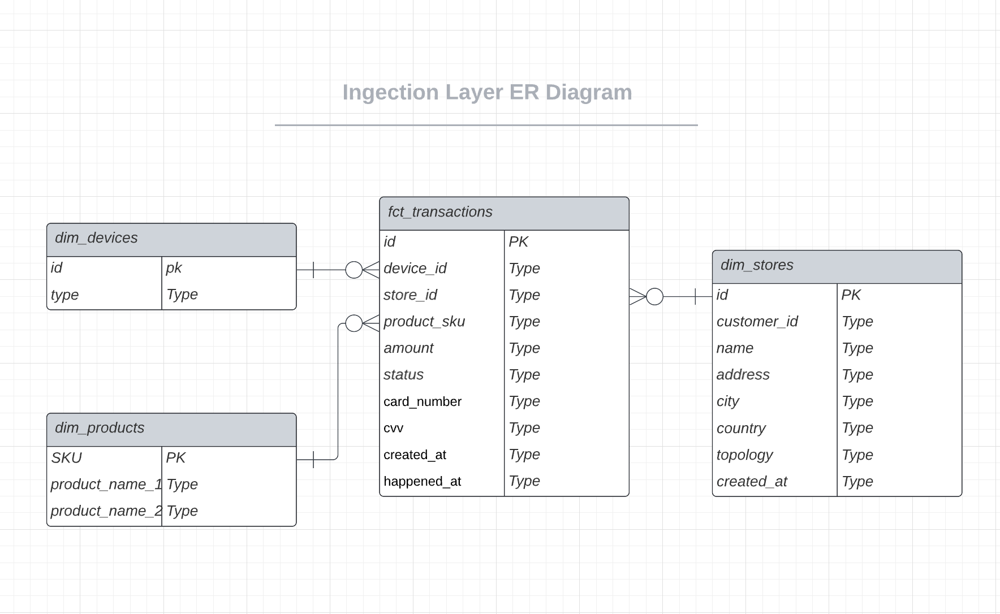
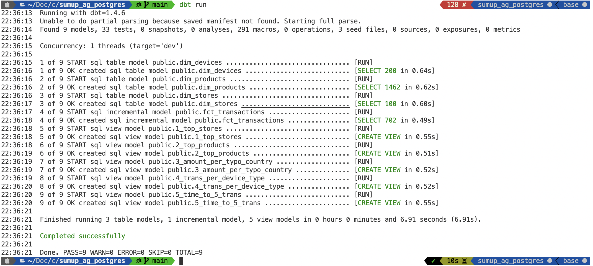

# Sum Up Takehome Assignment - Analytics Enginner

# Outline:
1. Solution high level description
2. Data model
3. Installation instructions

# 1. Solution description:
1. To solve the Take Home Assignment and answer all questions, I decided to split the ELT pipeline into two steps: `ingestion_layer` and `aggregation_layer`. 

For `ingestion_layer`, we can use star schema to model the data for efficient querying and analysis.
Based on the questions from the Take Home Assignment and considering potential future sources, the star schema will have one fact table `fct_transactions` and three dimension tables:
    - dim_stores 
    - dim_devices 
    - dim_products
    - *dim_customer (haven't implemented it because the lack of time)
    - *dim_time (haven't implemented it because the lack of time)

Since one of the requirements is to be able to scale the pipeline and process millions or billions of rows, `fct_transactions` will be created as a **incremental** table. The Data model of the ingestion_layer will be described below.

The `aggregation_layer` consists of separate aggregation queries that store the results in `views`.

2. We can use `dbt` to create tables in our DWH (i.g. Postgres in my example), as well as to `load` and `transform` data with SQL from CSV files (or other potential source) into the new star schema.
    - `dbt run` command will load the dimensions tables as well as **incrementally** load data to the fact table if our source tables will have millions of records
    - `dbt run --select ingestion_layer` will only run ingestion layer
    - `dbt run --select aggregation_layer` will only run aggregation layer

3. To run the pipeline daily, we can also use a simple scheduler like `crontab` or more advanced orchestration like Airflow. 

    ```
    0 0 * * * cd /path_to_project && dbt run
    ```

I have skipped this step because of the time constraints, but Airflow would be a much better solution for monitoring, rerunning, etc.

# 2. Data model

Here's the ER diagram for Ingesion layer:


# 3. Installation instructions

Install environment:

    pip install -r requirements.txt

Activate the environment:

    source env/bin/activate

Connect to Postgres DB:

[Link](https://docs.getdbt.com/reference/warehouse-setups/postgres-setup)

Run the pipeline:

    dbt run


# *4. Results:
